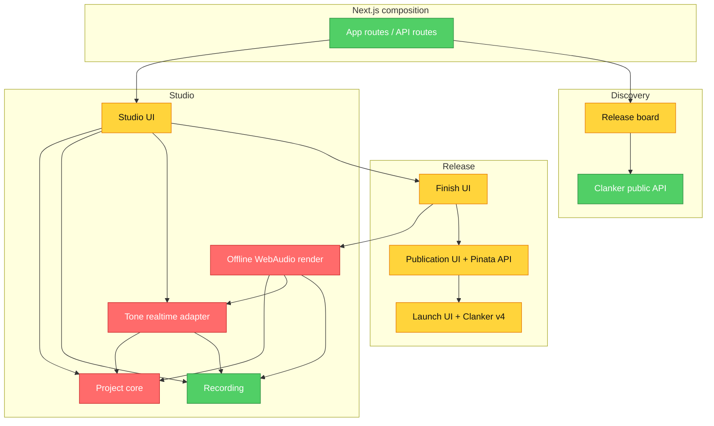

# Brooks-Lint Review

**Mode:** Architecture Audit
**Scope:** весь `src/` односервисного Next.js-приложения TickerBeat
**Health Score:** 48/100
**Trend:** First run — no trend data

Прототип уже доказывает полный путь «создать звук → опубликовать артефакт → запустить токен», но доменная модель и границы модулей пока не гарантируют, что сохранённый проект воспроизводит опубликованный мастер, а UI-компоненты несут слишком много orchestration-логики.

---

## Module Dependency Graph

---

## Findings

### Critical

**Domain Model Distortion — опубликованный project state не описывает весь мастер**

Symptom: `StudioProject` содержит только title, tempo, swing и четыре синтезаторных трека (`src/features/studio/core/model.ts:23`), а `SoundClip` живёт отдельно в React hook. Draft storage сериализует только `StudioProject` (`src/features/studio/core/project-storage.ts:99`). При рендере clip участвует в WAV, но `.tickerbeat.json` снова содержит только `{ version: 2, project }` (`src/features/studio/render/finish-panel.tsx:58`). См. красные узлы `ProjectCore` и `OfflineRender`.

Source: Domain-Driven Design — Supple Design / Intention-Revealing Interfaces

Consequence: опубликованный project hash не является воспроизводимым доказательством происхождения WAV: после перезагрузки записанный или импортированный звук теряется, а другой клиент не сможет восстановить тот же мастер.

Remedy: в `src/features/studio/core/model.ts` ввести версионированный `ProjectSnapshotV3` с `ClipReference` (content hash, asset id, source, trim/level settings), а binary Blob хранить через отдельный `ClipAssetStore` adapter на IndexedDB. Обновить `project-storage.ts`, finish pipeline и миграцию V2→V3 так, чтобы renderer принимал один полный snapshot. Это делает JSON каноническим описанием мастера, не помещая тяжёлый binary в localStorage.

**Knowledge Duplication — preview и master интерпретируют звук двумя независимыми способами**

Symptom: realtime path создаёт Tone.js `MembraneSynth`, `MonoSynth`, `PolySynth` и `Synth` со своими envelopes (`src/features/studio/audio/tone-engine.ts:39`, `src/features/studio/audio/tone-engine.ts:190`), тогда как offline path вручную создаёт WebAudio oscillators, gain envelopes, delay и compressor (`src/features/studio/render/render-project.ts:44`, `src/features/studio/render/render-project.ts:88`). Общими являются лишь несколько параметров и step events. См. красные узлы `RealtimeAudio` и `OfflineRender`.

Source: The Pragmatic Programmer — DRY / Knowledge Duplication

Consequence: пользователь может опубликовать WAV, который слышимо отличается от live-сессии; любое изменение инструмента требует синхронно и без ошибки обновить две реализации.

Remedy: создать чистый `src/features/studio/core/sound-plan.ts`, который из `ProjectSnapshotV3` строит детерминированные timed voice/clip events, envelopes и routing parameters. Tone realtime adapter и OfflineAudioContext renderer должны потреблять один `SoundPlan`, а parity tests должны сравнивать план и контрольные характеристики результата. В adapters останется только API конкретного движка.

### Warning

**Dependency Disorder — offline renderer зависит от realtime adapter**

Symptom: `src/features/studio/render/render-project.ts:3` импортирует `stepDurationMs` из `audio/tone-engine.ts`, хотя renderer и Tone engine являются соседними инфраструктурными adapters. См. стрелку `OfflineRender --> RealtimeAudio`.

Source: Clean Architecture — Dependency Rule

Consequence: замена Tone.js или реорганизация live playback затрагивает offline export, хотя tempo/swing timing является чистым доменным правилом.

Remedy: перенести timing functions в `src/features/studio/core/timing.ts`; оба adapter должны зависеть от core, но не друг от друга.

**Change Propagation — release workflow зашит во вложенность UI-компонентов**

Symptom: `Studio` условно монтирует `FinishPanel` (`src/features/studio/studio.tsx:268`), `FinishPanel` напрямую монтирует `PublishPanel` (`src/features/studio/render/finish-panel.tsx:162`), а `PublishPanel` — `LaunchPanel` (`src/features/publication/publish-panel.tsx:83`). Состояния render, publication и launch находятся локально внутри этих компонентов.

Source: Refactoring — Divergent Change / Shotgun Surgery

Consequence: закрытие панели или смена artifact уничтожает progress и receipts; добавление retry, resume, analytics или второго launch adapter потребует менять всю цепочку компонентов.

Remedy: ввести serializable `ReleaseSession` и reducer/state machine в `src/features/release/core/`; composition root должен владеть workflow, а Finish/Publish/Launch стать независимыми views, получающими state и команды. Переходы: `editing → rendering → rendered → publishing → published → reviewing → readyToLaunch → submitted → confirmed | failed`.

**Testability Seam — внешние SDK создаются внутри UI**

Symptom: `LaunchPanel` непосредственно создаёт `new Clanker(...)` (`src/features/launch/launch-panel.tsx:76`) и сам управляет wallet/network/receipt workflow; `PublishPanel` напрямую вызывает `fetch('/api/publish')` (`src/features/publication/publish-panel.tsx:24`). См. жёлтые узлы `Publication` и `Launch`.

Source: Working Effectively with Legacy Code — The Seam Model

Consequence: важные ветки retry, timeout, wrong-network и SDK failure проверяются через хрупкие component mocks вместо быстрых unit tests над use cases.

Remedy: определить небольшие ports `PublicationGateway` и `TokenLauncher` в release core; Pinata HTTP и Clanker v4 реализовать в adapters, а UI подключать через composition root. Не вводить общий DI-framework.

**Domain Model Distortion — board использует эвристическую выдачу как реестр релизов**

Symptom: `parseTickerBeatRelease` признаёт токен TickerBeat по `social_context.interface` или подстроке в description и извлекает audio URI regex-ом (`src/features/board/parse.ts:4`). Подтверждённый launch record после receipt verification отдельно не сохраняется.

Source: Domain-Driven Design — Anti-Corruption Layer

Consequence: изменение ответа Clanker API или текста description скрывает валидные релизы; неполная/поддельная metadata может попасть в board без связи с проверенным launch receipt.

Remedy: после подтверждения Base receipt формировать нормализованный `LaunchRecord` (token, creator, tx hash, block, metadata URI, audio URI) и хранить через простой server-side registry/reconciler. Clanker API оставить enrichment/fallback, а не единственным источником истины.

### Suggestion

**Cognitive Overload — один Studio component владеет слишком большим экраном и workflow**

Symptom: `src/features/studio/studio.tsx` содержит 491 строку и одновременно управляет project history, local persistence, selected track, playback, recording, finish disclosure и всем workbench layout; `studio.module.css` превышает 1400 строк.

Source: Clean Code — Single Responsibility Principle

Consequence: архитектурные изменения неизбежно задевают визуальную разметку, а последующий mobile-first redesign становится рискованным и медленным.

Remedy: после исправления core/release boundaries разделить экран на route-level stages `Make`, `Mix`, `Finish/Launch`, `Board` и co-located CSS modules. Не менять визуальный язык до стабилизации domain state.

**Dependency Disorder — recording type зависит от React hook implementation**

Symptom: `src/features/studio/recording/types.ts:1` импортирует `useSoundClip`, чтобы вычислить `ReturnTypeUseSoundClip`, поэтому тип UI-control зависит от конкретной hook-функции.

Source: Clean Architecture — Stable Abstractions Principle

Consequence: изменение hook API распространяется на presentation-компоненты и мешает использовать recording control вне React.

Remedy: объявить явные `SoundClip` и `SoundClipController` contracts в `recording/types.ts`; hook должен реализовывать contract, а не определять его косвенно.

---

## Summary

Первый приоритет — сделать `ProjectSnapshotV3` полным и воспроизводимым, затем заставить preview и offline master потреблять единый `SoundPlan`. После этого release workflow следует вынести из вложенных UI-компонентов и закрепить проверенные launches в собственном нормализованном registry; только затем безопасно переделывать интерфейс в staged DJ workflow.

Conway's Law не оценивался: проект сейчас ведётся одной командой, поэтому межкомандного несоответствия границ нет.

## Proposed target architecture

1. `studio/core` — `ProjectSnapshotV3`, timing, sound plan, reducers и migrations без browser/React dependencies.
2. `studio/adapters` — Tone realtime playback, OfflineAudioContext render, IndexedDB clip assets и local draft persistence.
3. `release/core` — `ReleaseSession`, переходы состояний, retry/invalidation rules и ports для публикации/launch.
4. `release/adapters` — Pinata publisher, Clanker v4 launcher и Base receipt verifier.
5. `discovery` — подтверждённый `LaunchRecord` + reconciler; Clanker public API используется для enrichment.
6. `app` — единственный composition root, который соединяет core, adapters и staged UI.

Эта схема остаётся одним Next.js-приложением: без нового монорепозитория, собственного launch-контракта или универсального DI-framework.
